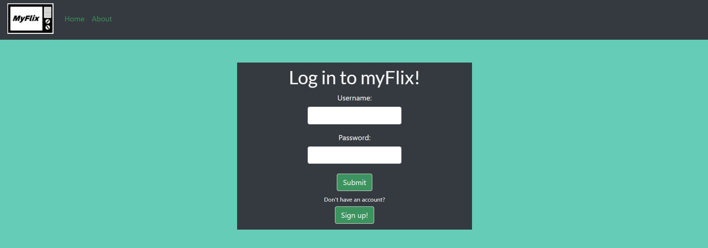
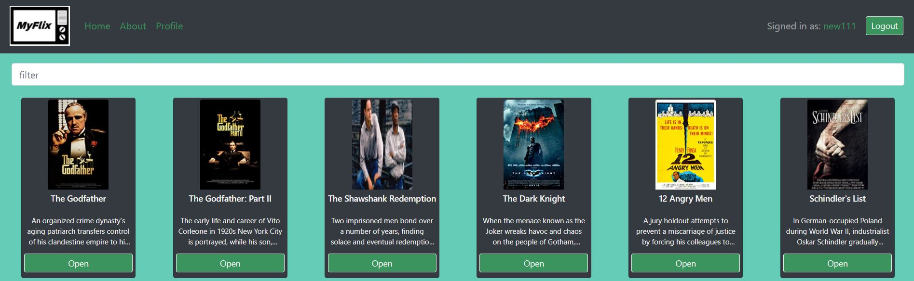

# myFlix-client
<p align="center">
  
<p>
<br>
<p align="center">
  
  </p>

## About the project
This is the client side of myFlix, a movie application. It is base on an existing server-side application called Movie-API.

## Technologies:

The following technologies are used:
- React
- Redux
- Bootstrap
- Parcel

## Getting Started

To run this project locally, follow the instruction below:

install dependencies:
```
npm install
```
build the app:
```
parcel [path to index.html]
```
open the application in browser on port 1234 (or port number stated in terminal)

```
https://localhost:1234/
```
## Project link:
- Github: https://github.com/hamedghd/myFlix-client
- Online: https://myflix-movieapi.netlify.app/

